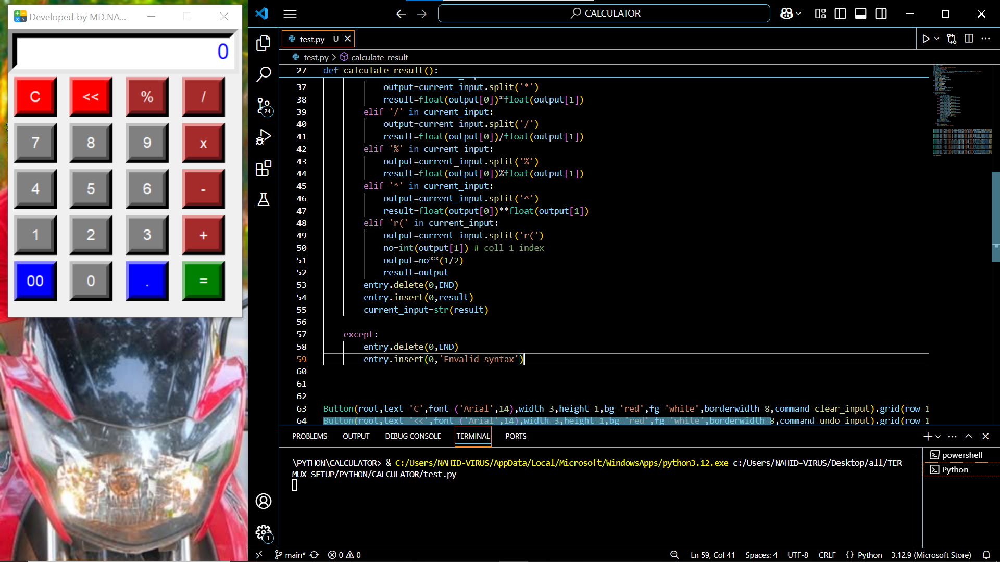
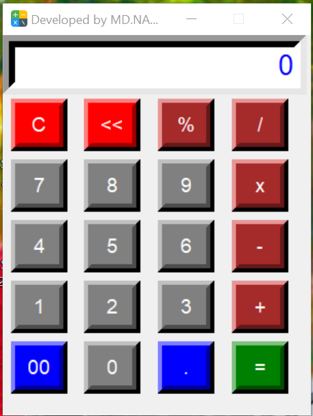
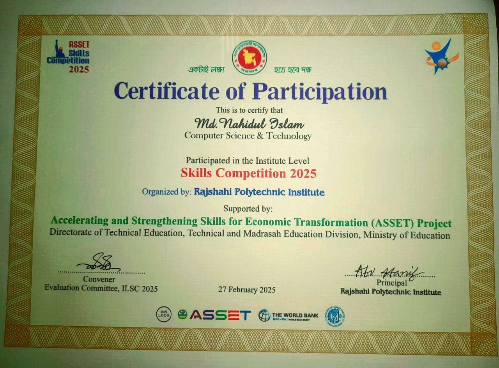

রাজশাহী পলিটেকনিক ইনস্টিটিউট : এই প্রোজেক্টে, আমি <b>Python</b> প্রোগ্রামিং ভাষা ব্যবহার করে একটি ক্যালকুলেটর তৈরি করেছি। 🔥
এই ক্যালকুলেটরটি মৌলিক গাণিতিক অপারেশন যেমন ➕ যোগ, ➖ বিয়োগ, ✖️ গুণ, এবং ➗ ভাগ করার জন্য ব্যবহার করা হয়।
এই প্রোজেক্টের মাধ্যমে আমি Python এর মৌলিক ফিচার এবং ফাংশনগুলো ব্যবহার করে কিভাবে একটি কার্যকরী ক্যালকুলেটর তৈরি করা যায় তা শিখেছি। 🎯

<h3 align="center">
 🌐 WELCOME TO CYBERCOP-404 🌐 
</h3>

---
## 📌 Project Preview 🔥
### 🖥️ Code Image

### 🔢 Calculator Image

### 🏅 Certificate 🎓

---
## 🔥 Technology Used 💻
- Python 🐍

---
## 🤖 Developer 👨‍💻
**MD. NAHIDUL ISLAM** 

---
### 💪 ENJOY THE PROGRAM 🚀
  
